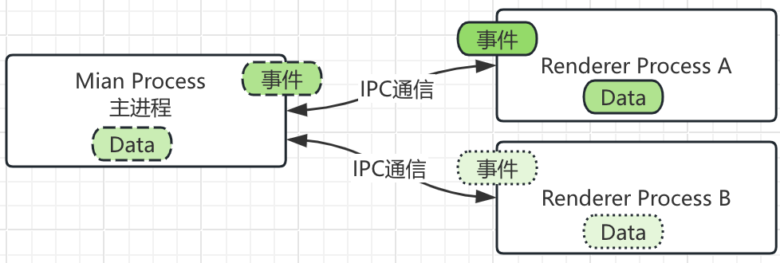

# 快速入门Electron  

集成环境-核心api-消息-打包/环境
以最快的形式，达到electron入门，此篇基本都是看electron官网精简而来

## 架构

Electron 中有`主进程`和`渲染进程`两个重要的概念，在主进程中用 Node 调用 Electron 封装好的 API 来创建窗口，管理应用整个生命周期，而在渲染进程中加载传统的 Web 界面。因此：

    ● main 目录用于存放跟主进程相关的代码
    ● preload 目录用于暴露ContextBridge通信的electron 相关api
    ● renderer 目录用于存放跟渲染进程相关的代码(chromium多进程结构，每个electron页面独立自己的进程)。

main <-ipc(事件驱动)-> render process(1:n)


main进程，采用node为开发语言，天生前端的利器
render进程，采用当下流行的react或vue框架均可，这个我们做前端的，都会的技能，而且还是`精通`的那种。【玩笑啦】

### Main Process

```json
    {
        "scripts": {
            // npx nodemon --help
            "start": "nodemon --exec electron .",
            "dev": "nodemon --exec electron . --watch ./ --ext js,html"
        }
    }
```

1. [app]( https://www.electronjs.org/zh/docs/latest/api/app) 控制应用程序的事件生命周期

   - 平台都支持

       ```shell
           # will-finish-launching: 应用程序完成基础的启动的时候被触发
           # ready: 当 Electron 完成初始化时，发出一次
           # window-all-closed: 当所有的窗口都被关闭时触发
           # before-quit: 在程序关闭窗口前发信号
           # will-quit: 当所有窗口被关闭后触发，同时应用程序将退出
           # quit: 在应用程序退出时发出
           # browser-window-blur: 当一个 browserWindow 失去焦点时触发
           # browser-window-focus: 当一个 browserWindow 获得焦点时触发
           # browser-window-created：当一个新的 browserWindow 被创建时触发
           # web-contents-created：当一个新的 webContents 被创建时触发
           # certificate-error：当对 url 的 certificate 证书验证失败的时候发出
           # select-client-certificate：当一个客户证书被请求的时候发出。
           # login：默认行为是取消所有身份验证。 默认行为是取消所有的验证行为，如果需要重写这个行为，你需要用 event.preventDefault() 来阻止默认行为，并且使用 callback(username, password) 来验证
           # gpu-info-update：每当有 GPU 信息更新时触发
           # child-process-gone：子进程意外消失时触发
           # accessibility-support-changed：当 Chrome 的辅助功能状态改变时触发
           # session-created：当 Electron创建了一个新的 session后被触发
           # second-instance：当第二个实例被执行并且调用 app.requestSingleInstanceLock() 时，这个事件将在你的应用程序的首个实例中触发
       ```

   - 仅macos
    
    ```ts 
        app.on('activate', () => {
            if(BrowserWindow.getAllWindows().length === 0) {
                createWindow();
            }
        })
    ```


2. ipcMain 从主进程到渲染进程的异步通信
    
    `on once removeListener removeAllListeners
    handle handleOnce removeHandler` 与 `ipcRenderer`对应的配套组合

    ```ts
        // index.ts
        ipcMain.handle('my-invokable-ipc', async (event, ...args) => {
            // event.reply(eventName, data);
            const result = await somePromise(...args)
            return result
        });

        // vue|react
        async () => {
            const result = await ipcRenderer.invoke ('my-invokable-ipc', arg1, arg2)
            // ...
        }
    ```

3. BrowserWindow 
   它是一个构造器，创建并控制浏览器窗口。 [options配置](https://www.electronjs.org/zh/docs/latest/api/browser-window#new-browserwindowoptions)

    几个配置，解释下，后面有对配置更深的理解，也会补录进来

    > webPreferences  
      - nodeIntegration：是否在Web工作器中启用了Node集成，就是说开启这个，前端代码里面，也可以用node相关的操作及api 
      
      - contextIsolation: 是否在独立 JavaScript 环境中运行 Electron API和指定的preload 脚本. 默认为 true, 但是当`nodeIntegration` 为 `true`时一般它要设为`false`

4. webContents
   官方解释为渲染以及控制 web 页面；`页面上下文`，即win下打开了多少这样的页对象面集合

5. 消息通道

    在 Electron 中，进程使用 ipcMain 和 ipcRenderer 模块，通过开发人员定义的“通道”传递消息来进行通信。 

    

    - 主进程通过 ipcMain.on|handle 监听;
    - 渲染进程通过 ipcRenderer.send|invoke 发送消息;
    - 主进程到渲染器进程, 消息需要通过WebContents 实例发送到渲染器进程,此 WebContents 实例包含一个 send 方法，其使用方式与 ipcRenderer.send 相同;
    - 默认情况下，渲染器进程没有权限访问 Node.js 和 Electron 模块。 作为应用开发者，您需要使用 contextBridge API 来选择要从预加载脚本中暴露哪些 API
    - 渲染器进程到渲染器进程, 通过主进程作为代理进行通知.
    - [进程通信](https://www.electronjs.org/zh/docs/latest/tutorial/ipc)

    - [通过消息端口进行进程间的通信](https://www.electronjs.org/zh/docs/latest/tutorial/message-ports)
        
        1. 消息端口是成对创建的。 连接的一对消息端口;
        2. 发送到port1 将被port2 接收，反之亦然;
        3. 允许在另一端还没有注册监听器的情况下就通过通道向其发送消息,此时消息将排队等待，直到一个监听器注册为。类似`Rx`中的`cold`操作符
        4. MessagePort 对象可以在渲染器或主 进程中创建，并使用 [ipcRenderer.postMessage][] 和 [WebContents.postMessage][] 方法互相传递。 请注意，通常的 IPC 方法，例如 send 和 invoke 不能用来传输 MessagePort, 只有 postMessage 方法可以传输 MessagePort。

        通过主进程传递 MessagePort，就可以连接两个可能无法通信的页面 (例如，由于同源限制)

        [示例](https://www.electronjs.org/zh/docs/latest/tutorial/message-ports#%E5%AE%9E%E4%BE%8B%E4%BD%BF%E7%94%A8)


### Renderer Process

1. ipcRenderer
    从渲染器进程到主进程的异步通信
    主要包括的方法：on，off，once，addListener，removeListener，send，invoke，sendSync，postMessage，sendToHost

    sendHost： 就像 ipcRenderer.send，不同的是消息会被发送到 host 页面上的 <webview> 元素，而不是主进程。

2. contextBridge
    在隔离的上下文中创建一个安全的、双向的、同步的桥梁。

    ```ts
        // Preload (Isolated World)
        const { contextBridge, ipcRenderer } = require('electron')

        contextBridge.exposeInMainWorld(
            'electron',
            {
                doThing: () => ipcRenderer.send('do-a-thing')
            }
        );

        // renderer
        window.electron.doThing()
    ```


### 安全性

[安全](https://www.electronjs.org/zh/docs/latest/tutorial/security)

### 全局快捷键

globalShortcut方式register｜unRegister；全屏、缩放；

### 热键

docker 和 menu方式支持热键设置